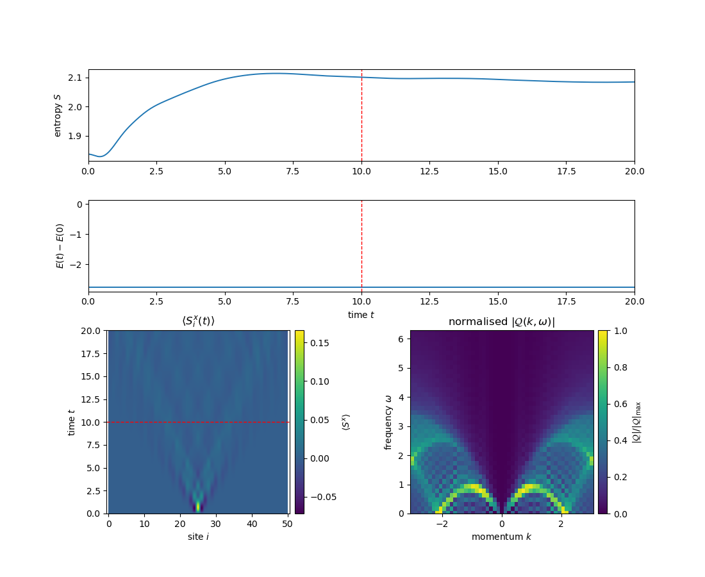
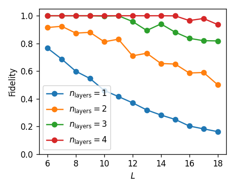

# Quench Simulation

Reproducing some of the results from [arXiv:2501.04649](https://arxiv.org/abs/2501.04649). Using TeNPy for the classical simulation and QiSkit for the quantum algorithms.


## Notes
- V1 and V2 of the paper appears to have some typos in the construction of $G(\theta)$, $H_{12}(\theta)$ and other details.
- The included Mathematica file cross-checks some of these formulas.


## Quantum algorithm (QiSkit)
The quantum algorithm can be run by using a config file as

```bash
python main.py --config config.yaml
```

the /configs folder contains a few examples.

type of tasks: simulate | run_qc | post_process
  - simulate: simulates quantum computer locally (using Qiskit Aer)
  - run_qc: run on IBM quantum computer, will store job id and data used in `job_log.jsonl` file
  - post_process: post process code already run on IBM quantum computer or in simulator by providing job_id or job_num and data_source (simulation or ibm)
  

Post process computes $\langle S^x_i\rangle$ and Quench Spectral Function $Q(\omega,k)$ from raw measurement bitstrings

## Classical simulation (TeNPy):
- Can be run from root folder as: 
```bash
python -m classical_simulation.1d_Fermi_Hubbard_quench_spectroscopy
```
- Parameters are hardcoded in classical_simulation/1d_Fermi_Hubbard_quench_spectroscopy.py
- The code uses Time-Dependent Variational Principle (TDVP) with Matrix Product States (MPS)

<p align = center>
  
</p>


### DGA state and optimization
#### VQE
The paper uses the Dense Givens Approximate (DGA) to approximate a Slater determinant state and uses Variational Quantum Eigensolver (VQE) to optimize the parameters (classically). This has been implemented in `run_VQE_for_DGA` function in `runners/run_VQE_DGA.py`. In `utils/VQE_convergence.py` I have implemented functions for more advanced step sizes, for faster convergence, class to check fidelity for checking convergence and early terminaion, and a class to track and live plot progress. In `run_VQE_for_DGA`, many of the details can be controlled.

See `tests/fidelity_test_DGA_VQE.py` for usage of these VQE functionality.

<p align = center>
  
</p>


##### Bug in qiskit-algorithms 0.4.0
There is a minor bug in the VQE class of qiskit-algorithms version 0.4.0. The VQE callback does not pass full list of parameters, it instead passes the first parameter only. in `BUG_FIXES/VQE_CALLBACK_BUG_FIX.py` I have fixed the bug locally, until it is fixed in qiskit-algorithms.


#### Much faster DGA optimization
Instead of using VQE, as in the paper, I found a significantly faster way to maximize fidelity of DGA state and the target Slaters determinant state.

Take states
$$|\psi_A\rangle = a_1^\dagger \cdots a_{N_f}^\dagger\ket 0,$$
where
$$a_i^\dagger = \sum_x A_{xi} c_x^\dagger.$$
Here $A_{xi}$ is a matrix with the occupied orbitals.

One can show that the overlap of two such states are given by
$$\langle\psi_A | \psi_B\rangle = \det(A^\dagger B).$$

For the Slaters state $A^T = Q$ (where $Q$ is the orbital matrix usually used in the litterature). While for the DGA state $B$ can be built out of bricks of Givens rotations. 

The computation of fidelity using this, is much faster than using qiskit circuits. As seen in `tests/faster_fidelity_test.py`, for `L = 12` and `n_layer = 1` DGA, it's over 300,000 times faster than qiskit circuits (simulated with aer).

This determinant can be very efficiently maximized, almost instantly for any size. In `utils/optimize_fidelity.py` this is implemented using scipy.optimize and the [L-BFGS-B](https://en.wikipedia.org/wiki/Limited-memory_BFGS) algorithm. To ensure global minimum is found, I use a multi-start strategy, with a Sobol sequence to distribute initial points. The codes runs multi-threaded.

## Jobs run on real quantum computer
Jobs run on real quantum computer are logged in `logs/job_log_ibm.jsonl`, while those run in local simulator are logged in `logs/job_log_simulation.jsonl`. The simulation runs also save the measurements.

In order to print a table of jobs and details run

```bash
python main.py --jobs simulation
```

Example output
```bash
#  backend        L   N_f  T      J      U      N_Trot  shots  state   layers  fidelity  job_id                                timestamp                 
-  -------------  --  ---  -----  -----  -----  ------  -----  ------  ------  --------  ------------------------------------  --------------------------
1  aer_simulator  12  8    3.000  1.000  3.000  6       4096   DGA     3       0.958     817c33e7-ac5d-4c18-b8d6-ffa20fcb1375  2025-09-26T15:17:12.277787
2  aer_simulator  15  10   3.000  1.000  3.000  10      4096   DGA     3       0.881     84484459-8044-4fd0-a3b1-439e9f096f55  2025-09-26T15:56:49.040633
3  aer_simulator  15  10   3.000  1.000  3.000  10      4096   slater  0       1.000     7165ec8d-214f-48ec-9660-add4bdb97e76  2025-09-26T16:36:43.242754
4  aer_simulator  15  10   3.000  1.000  3.000  10      4096   DGA     4       0.999     d2a9248d-ca11-43ae-be86-612d4368e77e  2025-09-26T17:48:06.143863
```

or

```bash
python main.py --jobs ibm
```

Example output
```bash
#  backend     L   N_f  T      J      U      N_Trot  shots  state  layers  fidelity  job_id                timestamp                 
-  ----------  --  ---  -----  -----  -----  ------  -----  -----  ------  --------  --------------------  --------------------------
1  ibm_torino  16  10   3.000  1.000  3.000  6       4096   DGA    3       0.864     d3apk6k86mts73dtts10  2025-09-25T20:48:46.998320
2  ibm_torino  15  10   3.000  1.000  3.000  10      4096   DGA    3       0.881     d3aq9dc86mts73dtufmg  2025-09-25T21:23:17.803502
```